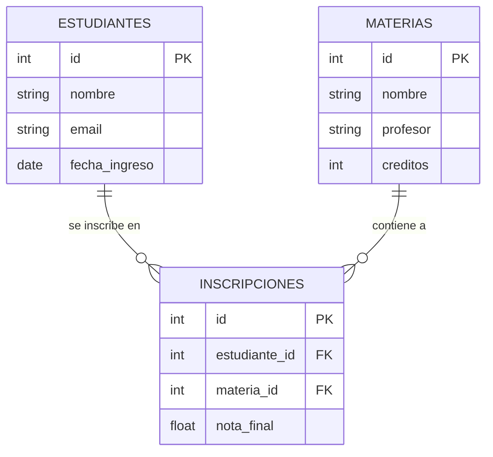
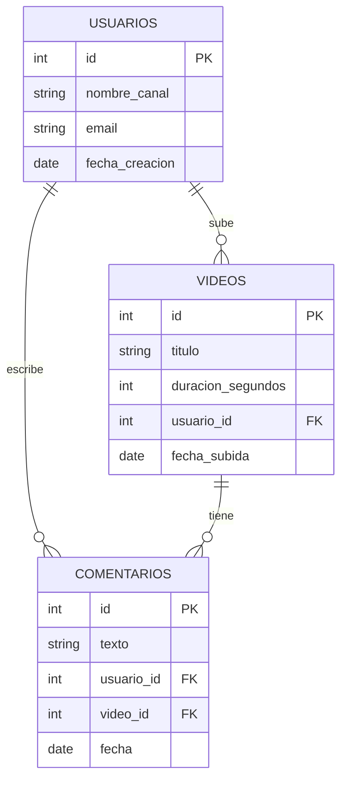
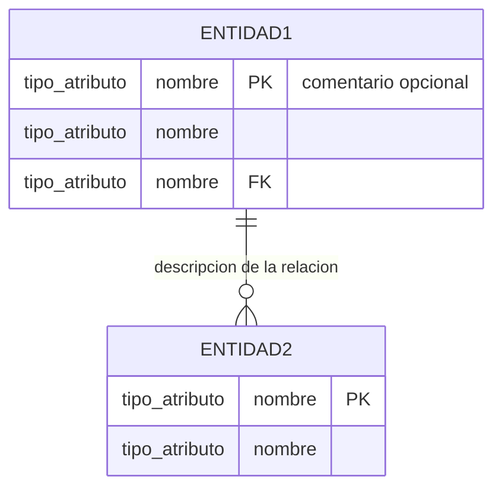

# Práctica 3 — Clase 7: Modelado Visual de Bases de Datos con Mermaid

> Ejercicio práctico: Aprender a diseñar la estructura de una base de datos usando diagramas Entidad-Relación (ER) con Mermaid. No se escribe una línea de código SQL — se dibuja lo que la base de datos va a guardar.

---

## ¿Por qué modelar antes de construir?

Imaginá que vas a construir una casa. ¿Empezarías poniendo ladrillos sin un plano? No. Primero dibujás dónde va la cocina, el baño, las habitaciones. **Modelar una base de datos es dibujar el plano de tu sistema de información.**

Si modelás mal:
- Datos que no se conectan entre sí
- Información repetida por todos lados
- Consultas que tardan 3 minutos en vez de 0.003 segundos

Si modelás bien:
- Todo conectado con llaves
- Cero repetición innecesaria
- La IA encuentra lo que necesita al instante

> **El Ingeniero de IA no pone ladrillos. Dibuja el plano para que otros construyan.**

---

## Herramienta: Mermaid Live Editor

Mermaid es un lenguaje que convierte texto simple en diagramas profesionales. Vas a escribir algo así:

```
estudiantes {
  int id
  string nombre
}
```

Y Mermaid lo convierte en una caja con el nombre de la tabla y sus columnas. **Sin arrastrar cuadritos, sin PowerPoint.**

### Abrí el editor

1. Entrá a **[mermaid.live](https://mermaid.live)**
2. Del lado izquierdo escribís el código
3. Del lado derecho ves el diagrama en tiempo real
4. Podés exportar como PNG o SVG

---

## Conceptos clave (en 2 minutos)

```
┌─────────────────────────────────────────────────────────┐
│              ENTIDAD = TABLA                             │
│  ┌──────────────────────────┐                            │
│  │      ESTUDIANTES         │  ← Nombre de la entidad    │
│  ├──────────────────────────┤                            │
│  │ id        INT     PK     │  ← Llave Primaria (única)  │
│  │ nombre    STRING         │  ← Atributo normal         │
│  │ email     STRING         │  ← Atributo normal         │
│  │ materia_id INT    FK     │  ← Llave Foránea (conecta  │
│  └──────────────────────────┘    con otra tabla)         │
└─────────────────────────────────────────────────────────┘

PK = Primary Key (Llave Primaria)
     El identificador único. Como tu número de cédula. No puede repetirse.

FK = Foreign Key (Llave Foránea)
     El "enchufe" que conecta esta tabla con otra. Como un número de teléfono 
     que te conecta con otra persona.
```

---

## Ejemplo 1: El Aula de Clases (seguilo paso a paso)

### El problema

Queremos guardar en una base de datos:
- Qué **estudiantes** están inscritos
- Qué **materias** existen
- En qué **materia** está inscrito cada estudiante (y su nota)

### Paso 1: Identificar las entidades (tablas)

Preguntate: ¿de qué "cosas" quiero guardar información?

| ¿Qué guardo? | Entidad (tabla) |
|-------------|-----------------|
| Datos de cada alumno | `ESTUDIANTES` |
| Datos de cada materia | `MATERIAS` |
| Qué alumno está en qué materia y con qué nota | `INSCRIPCIONES` |

> **Regla de oro:** Si necesitás guardar "qué A está relacionado con qué B", eso va en una **tercera tabla** (la tabla de relación). No metas la materia dentro del estudiante.

### Paso 2: Definir atributos (columnas)

```
ESTUDIANTES necesita guardar:
  - id          → número único que identifica a cada estudiante
  - nombre      → texto
  - email       → texto
  - fecha_ingreso → fecha

MATERIAS necesita guardar:
  - id          → número único que identifica a cada materia
  - nombre      → texto
  - profesor    → texto
  - creditos    → número

INSCRIPCIONES necesita guardar:
  - id              → número único que identifica cada inscripción
  - estudiante_id   → ¿qué estudiante? (FK → ESTUDIANTES)
  - materia_id      → ¿qué materia? (FK → MATERIAS)
  - nota_final      → número
```

### Paso 3: Escribirlo en Mermaid

Copiá este código en [mermaid.live](https://mermaid.live):



### Paso 4: Leer el diagrama

El resultado debería verse así (Mermaid lo dibuja automáticamente):

```
┌──────────────────────┐       ┌──────────────────────────┐       ┌──────────────────────┐
│     ESTUDIANTES      │       │      INSCRIPCIONES       │       │       MATERIAS       │
├──────────────────────┤       ├──────────────────────────┤       ├──────────────────────┤
│ id        INT   PK   │──┐    │ id            INT   PK   │    ┌──│ id        INT   PK   │
│ nombre    STRING     │  │    │ estudiante_id INT   FK   │────┘  │ nombre    STRING     │
│ email     STRING     │  └───▶│ materia_id    INT   FK   │──────▶│ profesor  STRING     │
│ fecha_ingreso DATE   │       │ nota_final    FLOAT      │       │ creditos  INT        │
└──────────────────────┘       └──────────────────────────┘       └──────────────────────┘
        │                                    │                              │
        │   "un estudiante se inscribe      │   "una materia contiene       │
        │    en muchas inscripciones"        │    muchas inscripciones"      │
        └────────────────────────────────────┴──────────────────────────────┘
```

### Paso 5: Entender cómo se ve con datos reales

```
TABLA: estudiantes               TABLA: materias
┌────┬─────────┬────────────────┐ ┌────┬───────────────┬──────────┐
│ id │ nombre  │ email          │ │ id │ nombre        │ profesor │
├────┼─────────┼────────────────┤ ├────┼───────────────┼──────────┤
│ 1  │ María   │ maria@mail.com │ │ 10 │ Matemáticas   │ López    │
│ 2  │ Carlos  │ carlos@mail.com│ │ 20 │ Programación  │ García   │
│ 3  │ Ana     │ ana@mail.com   │ │ 30 │ IA Aplicada   │ Jorge    │
└────┴─────────┴────────────────┘ └────┴───────────────┴──────────┘

TABLA: inscripciones
┌─────┬───────────────┬────────────┬───────┐
│ id  │ estudiante_id │ materia_id │ nota  │
├─────┼───────────────┼────────────┼───────┤
│ 100 │      1        │     10     │  8.5  │  ← María en Matemáticas
│ 101 │      1        │     20     │  9.0  │  ← María en Programación
│ 102 │      2        │     20     │  7.0  │  ← Carlos en Programación
│ 103 │      3        │     30     │  9.5  │  ← Ana en IA Aplicada
└─────┴───────────────┴────────────┴───────┘
```

> **La magia:** `inscripciones.estudiante_id = 1` se conecta con `estudiantes.id = 1` (María). No repito el nombre de María 100 veces. Solo guardo el número.

---

## Ejemplo 2: YouTube — Misma lógica, otro negocio

Copiá este código en Mermaid para ver cómo modelarías YouTube:



**Pregunta:** ¿Por qué `COMENTARIOS` tiene DOS llaves foráneas (`usuario_id` y `video_id`)?

<details>
<summary>Respuesta (pensalo primero)</summary>

Porque un comentario necesita saber DOS cosas: **quién** lo escribió (usuario) y **en qué video** fue escrito (video). Necesita conectarse a ambas tablas.

</details>

---

## Tu turno: Modelá tu propia base de datos

### Elegí UNO de estos 3 casos:

#### Caso A: Tienda Online
> Una tienda vende productos. Cada producto tiene nombre, precio y stock. Los clientes (nombre, email) pueden hacer pedidos. Un pedido puede contener varios productos.

#### Caso B: Veterinaria (la de los apuntes)
> Una clínica veterinaria tiene doctores (nombre, especialidad) y mascotas (nombre, especie, dueño). Se registran citas: qué doctor atiende a qué mascota, en qué fecha y hora.

#### Caso C: Red Social Simple
> Una red social tiene usuarios (nombre, bio). Los usuarios pueden publicar posts (texto, fecha) y seguir a otros usuarios. También pueden dar "like" a posts.

---

### ✍️ Completá esta tabla primero (en papel o en un bloc de notas)

**Elegí el caso: ________**

| Pregunta | Tu respuesta |
|----------|-------------|
| ¿Qué entidades (tablas) necesito? | |
| ¿Cuál es la PK de cada entidad? | |
| ¿Qué atributos tiene cada entidad? | |
| ¿Dónde van las FK? (¿qué tabla se conecta con cuál?) | |

---

### Después pasalo a Mermaid

Abrí [mermaid.live](https://mermaid.live) y escribí tu diagrama. Usá esta plantilla:



**Tipos de atributos que podés usar:** `int`, `string`, `float`, `date`, `boolean`

**Tipos de relaciones:**
| Símbolo | Significado | Ejemplo |
|---------|-------------|---------|
| `\|\|--o{` | Uno a muchos | Un usuario tiene muchos videos |
| `}\|--\|\|` | Uno a uno | Una persona tiene un pasaporte |
| `}o--o{` | Muchos a muchos | Estudiantes se inscriben en materias |

---

## Exportá tu diagrama

1. En mermaid.live, clic en el ícono de cámara 📷 (o menú **Actions → PNG**)
2. Guardá la imagen como `modelo-bd.png`
3. Creá una carpeta `Clase-07-Bases-de-Datos-para-IA/mi-modelo/` en tu repositorio
4. Guardá ahí la imagen y creá un `README.md` explicando tu modelo

### Plantilla del README.md:

```markdown
# Mi Modelo de Base de Datos — [Nombre del caso]

## Caso elegido
[Tienda Online / Veterinaria / Red Social]

## Diagrama Entidad-Relación


## Explicación

### Entidades
- **[Nombre entidad 1]:** [qué guarda]
- **[Nombre entidad 2]:** [qué guarda]

### Relaciones
- [Entidad A] se conecta con [Entidad B] porque [razón]

### ¿Qué tipo de base de datos usaría para este modelo?
- [Relacional / NoSQL / Vectorial] porque [razón]
```

---

## Compartí tu modelo

Subilo a tu repositorio de GitHub y compartí el link en el grupo de la clase.

---

## Ronda de revisión (en parejas)

Intercambiá tu diagrama con un compañero y revisen:

| ¿Está bien? | Pregunta para el compañero |
|-------------|---------------------------|
| [ ] | ¿Falta alguna entidad que debería estar? |
| [ ] | ¿Sobra alguna entidad? |
| [ ] | ¿Las PK están bien elegidas? (¿son realmente únicas?) |
| [ ] | ¿Las FK conectan las tablas correctas? |
| [ ] | ¿La relación es del tipo correcto? (1 a muchos, muchos a muchos...) |

---

## El Ing. de IA en esta práctica

Modelar bases de datos no es "cosa de programadores". Es cosa de **arquitectos de información**. Y ese sos vos.

| Lo que hiciste | Por qué es rol de Ingeniero de IA |
|---------------|----------------------------------|
| Identificaste entidades | Antes de elegir PostgreSQL o MongoDB, tenés que saber QUÉ vas a guardar |
| Definiste PK y FK | Las llaves determinan la velocidad de las consultas. FK mal puestas = sistema lento |
| Dibujaste el modelo | Un diagrama se comparte con el equipo, el cliente, y la IA que te ayuda a programar |
| Elegiste tipo de BD | Conecta directamente con la matriz de decisión de los apuntes |

> **Un Ingeniero de IA no le tiene miedo a las bases de datos. Las diseña, las modela, y sabe explicar por qué eligió cada tabla, cada columna y cada conexión.**

---

## Bonus: ¿Cómo se ve esto en código real?

Si tu modelo estuviera en PostgreSQL, crear las tablas sería:

```sql
CREATE TABLE estudiantes (
    id SERIAL PRIMARY KEY,
    nombre VARCHAR(100) NOT NULL,
    email VARCHAR(150) UNIQUE NOT NULL,
    fecha_ingreso DATE DEFAULT CURRENT_DATE
);

CREATE TABLE materias (
    id SERIAL PRIMARY KEY,
    nombre VARCHAR(100) NOT NULL,
    profesor VARCHAR(100),
    creditos INT DEFAULT 3
);

CREATE TABLE inscripciones (
    id SERIAL PRIMARY KEY,
    estudiante_id INT REFERENCES estudiantes(id),
    materia_id INT REFERENCES materias(id),
    nota_final DECIMAL(3,1)
);
```

**No necesitás escribir esto.** Pero fijate que cada línea de código SQL se parece muchísimo a lo que dibujaste en Mermaid. El modelo es el plano. El SQL son los ladrillos.

---

## 🏆 Criterios de Éxito

Completaste la práctica exitosamente si:
- [ ] Abriste mermaid.live y replicaste el ejemplo del aula
- [ ] Elegiste uno de los 3 casos (Tienda / Veterinaria / Red Social)
- [ ] Identificaste al menos 2 entidades con sus atributos
- [ ] Definiste PK para cada entidad
- [ ] Conectaste las entidades con FK donde correspondía
- [ ] Tu diagrama Mermaid compila sin errores (se ve en el panel derecho)
- [ ] Exportaste la imagen y creaste el README.md explicativo
- [ ] Respondiste qué tipo de base de datos usarías para tu modelo (SQL, NoSQL, etc.)
- [ ] Podés explicarle a alguien la diferencia entre PK y FK
