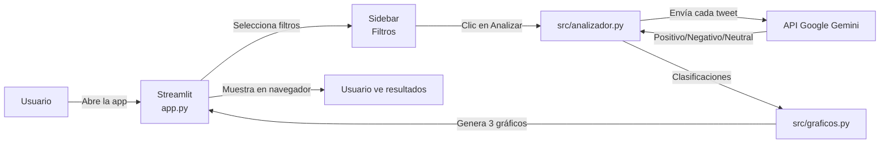
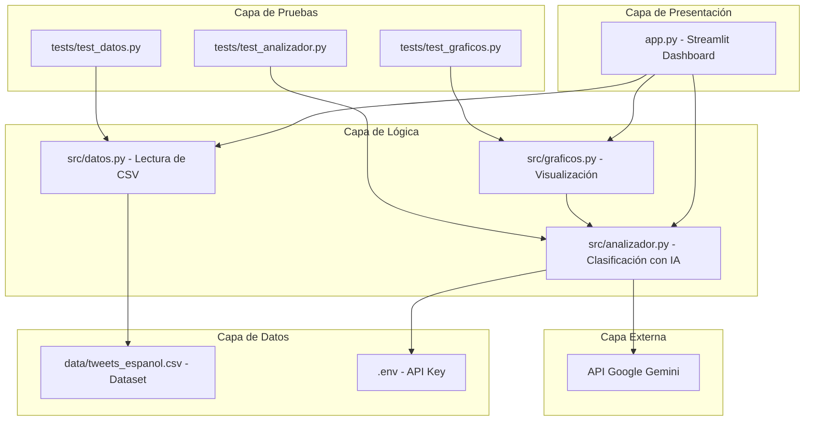
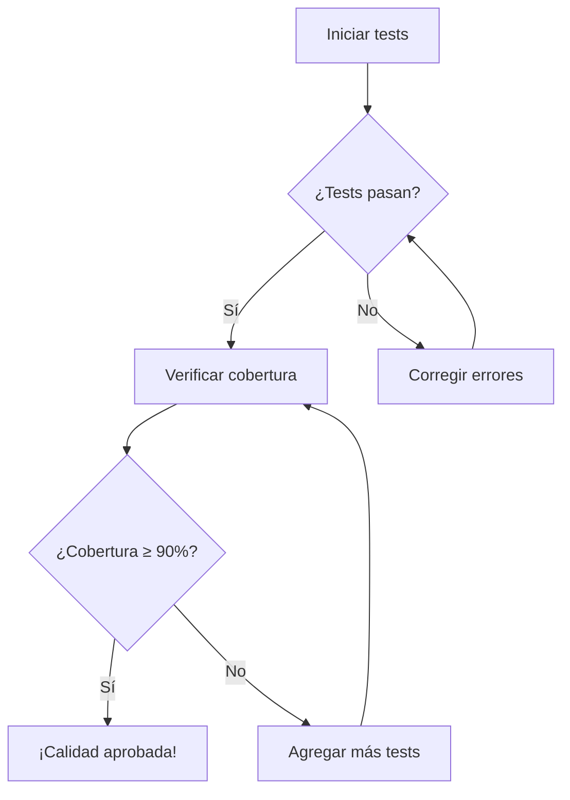
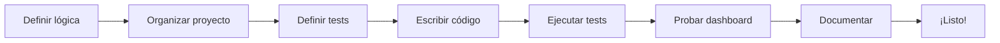

# Arquitectura del Sistema: Vibe Check IA

## Diagrama de Flujo Principal



---

## Arquitectura por Capas



---

## Componentes del Sistema

| Componente | Archivo | Responsabilidad |
|------------|---------|-----------------|
| **Dashboard Principal** | `app.py` | Interfaz de usuario, filtros y visualización |
| **Analizador** | `src/analizador.py` | Envía tweets a Gemini y recibe clasificación |
| **Datos** | `src/datos.py` | Lee, valida y limpia el CSV |
| **Gráficos** | `src/graficos.py` | Genera pastel, barras y línea de tiempo |
| **Tests Analizador** | `tests/test_analizador.py` | Verifica clasificación con mocks |
| **Tests Datos** | `tests/test_datos.py` | Verifica lectura del CSV |
| **Tests Gráficos** | `tests/test_graficos.py` | Verifica generación de gráficos |
| **Configuración** | `.env` | API Key de Google Gemini |
| **Documentación** | `*.md` | Contexto, arquitectura, estado |

---

## Flujo de Datos Detallado

```
1. USUARIO abre app.py en el navegador
       ↓
2. STREAMLIT carga el dashboard con filtros
       ↓
3. USUARIO selecciona filtro (opcional) y hace clic en "Analizar"
       ↓
4. APP.PY llama a datos.py para leer el CSV
       ↓
5. DATOS.PY lee tweets_espanol.csv con pandas
       ↓
6. APP.PY pasa los tweets a analizador.py
       ↓
7. ANALIZADOR.PY para cada tweet:
   a. Envía texto a GEMINI API
   b. Recibe clasificación
   c. Guarda resultado
       ↓
8. ANALIZADOR.PY devuelve lista clasificada
       ↓
9. APP.PY llama a graficos.py para crear visualizaciones
       ↓
10. GRAFICOS.PY genera 3 gráficos Plotly:
    - Pastel: distribución porcentual
    - Barras: conteo por emoción
    - Línea: evolución temporal
       ↓
11. APP.PY muestra gráficos EN VERTICAL uno debajo del otro
       ↓
12. USUARIO ve resultados en navegador
```

---

## Decisiones Técnicas

| Decisión | Razón |
|----------|-------|
| **Estructura src/** | Separar lógica de presentación |
| **Estructura tests/** | Aislar pruebas del código principal |
| **Streamlit** | Fácil de usar, no requiere HTML/CSS |
| **Google Gemini** | API gratuita, potente, en español |
| **Plotly** | Gráficos interactivos y profesionales |
| **Pandas** | Manipulación eficiente de datos |
| **Mocks en tests** | No gastar tokens reales |
| **Gráficos verticales** | Mejor legibilidad en pantallas estándar |
| **Layout wide** | Aprovechar toda la pantalla |

---

## Flujo de Pruebas



---

## Flujo de Desarrollo


